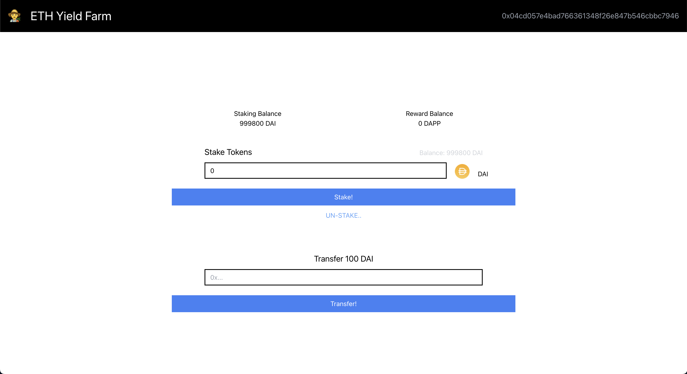

<p align="center">
  <br />
  
  <br/>
  <br />
  <p align="center">


</p>

<br/>

[](#table-of-contents)

<br/>

## • Overview

This project is made following [this instructions](https://app.unchain.tech/learn/ETH-NFT-Game/). Engineer cmmunity `UNCHAIN` is one of the best one to learn blockchain development.

This is dapp that you can play simple game on Ethereum blockchain. You can mint character NFT and battle with a boss character.

## • Links

[Deployed here](https://eth-yield-farm.vercel.app/)

[](https://eth-yield-farm.vercel.app/)

## • Launch

1. run `yarn install` in terminal.

2. make `.env` file under `packages/contract` and input your `Private Key` and `Alchemy HTTP Key` like below.

```
PRIVATE_KEY = <YOUR_PRIVATE_KEY>
STAGING_ALCHEMY_KEY = <ALCHEMY_HTTP_KEY>
```

3. run `yarn contract deploy` in terminal. The result would be like below.

```
Deploying contracts with account:  0x04CD057E4bAD766361348F26E847B546cBBc7946
Dai Token Contract has been deployed to:  0x2669735E2C18111EC5C0ae86e09dF6e20EA7FBdF
Dapp Token Contract has been deployed to:  0x90BF2171419Ffe4b91b08049FEB92b0Afbb33686
TokenFarm Contract has been deployed to:  0x1698eA024B6e69D51161cBDef290a8b391C136E6
```

4. change the line 23~25 in `packages/client/src/App.js`.

```javascript
const daiTokenAddress = '<DAI_TOKEN_CONTRACT_ADDRESS>';
const dappTokenAddress = '<DAI_TOKEN_CONTRACT_ADDRESS>';
const tokenfarmAddress = '<DAI_TOKEN_CONTRACT_ADDRESS>';
```

5. replace the json files in `packages/client/src/ABIs/` with the content of the json files in `packages/contract/artifacts/contracts`.

6. Finally, run `yarn client start` in terminal and see how it works!
